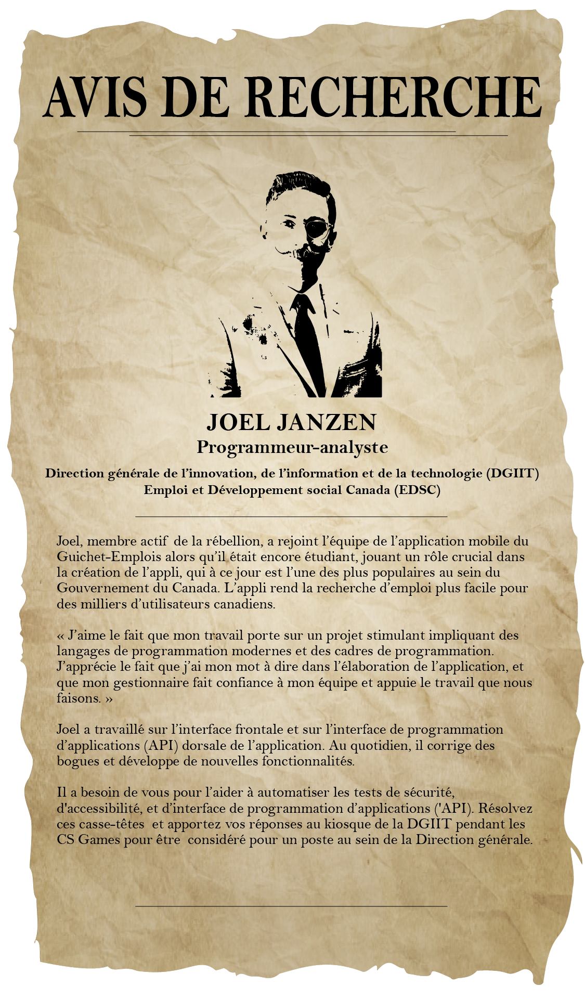
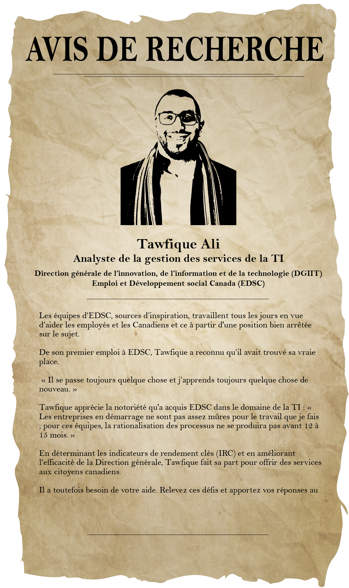

[Français](#Défis-cs-games)

# CS Games Challenges

Learn about the dynamic individuals working at ESDC and solve their challenges! Afterwards, bring your answers to the ESDC booth (or make a fork/branch of this repo with the solutions) to have a conversation and explore an opportunity to be a central part of the digital public service revolution happening right now in the Government of Canada!

*(Psst...even if you don't solve the challenges, we would still love to talk to you...)

**Note that our challenges won’t be worth any points in the Puzzle Hero competition, but they will give you the opportunity to be considered for a job within the Branch.

## Challenge Links

- [Challenge 1](#challenge-1)
- [Challenge 2](#challenge-2)
- [Challenge 3](#challenge-3)
- [Challenge 4](#challenge-4)
<!-- - [Challenge 5](#challenge-5)
- [Challenge 6](#challenge-6)
- [Challenge 7](#challenge-7)
- [Challenge 8](#challenge-8)
- [Challenge 9](#challenge-9)
- [Challenge 10](#challenge-10) -->

**If You've never used Git and Github before:**

1.  Register an account and login
2.  Return to this repo and press "Fork" at the top of the page
3.  When it asks where to fork the repo to, select your account
4.  On your fork's page, press "Clone or download" and copy the url
5.  On your local system, ensure you have Git installed (Download and install Git Bash for Windows or install with Homebrew on MacOS)
6.  In a new terminal on your local system (Open a new Git Bash window on Windows) create a new directory where you want your code to exist
7.  With your terminal, enter into the directory you just created
8.  Execute ``git clone`` followed by the link you copied in the 4th step
9.  Your fork will now be copied into the directory on your system
10. Keeping the Git Bash/terminal window open, open your new directory in your favourite Integrated Development Environment (IDE)
11. At this point you can start creating new files, changing existing files and git will track these changes
12. To save your changes in Git and push it to your repo on Github, we begin with "staging" our changes before "committing". With staging, we are selecting the files whose changes we want to be tracked in our next Git commit. The commit is the action in which we actually save the changes to our repo's Git history
13. To stage your changes all at once, in your Git Bash/terminal window, execute the command  ``git add --a``. This will tell Git to stage all code changes since the last commit, into the next commit
14. Now we can commit our changes by executing ``git commit -m 'Your commit message'``, where 'Your commit message' is the label you want to have for this commit
15. Once our changes are committed, we can push these changes up to our repository on Github by executing ``git push``
16. At this point, you should be prompted for your Github username and password to authorize the push to the repository
17. If succesful, you should now see your changes reflected on Github!

## Challenge 1

In the 20×20 grid below, four numbers along a diagonal line have been bolded.

<pre>
08 02 22 97 38 15 00 40 00 75 04 05 07 78 52 12 50 77 91 08
49 49 99 40 17 81 18 57 60 87 17 40 98 43 69 48 04 56 62 00
81 49 31 73 55 79 14 29 93 71 40 67 53 88 30 03 49 13 36 65
52 70 95 23 04 60 11 42 69 24 68 56 01 32 56 71 37 02 36 91
22 31 16 71 51 67 63 89 41 92 36 54 22 40 40 28 66 33 13 80
24 47 32 60 99 03 45 02 44 75 33 53 78 36 84 20 35 17 12 50
32 98 81 28 64 23 67 10 <b>26</b> 38 40 67 59 54 70 66 18 38 64 70
67 26 20 68 02 62 12 20 95 <b>63</b> 94 39 63 08 40 91 66 49 94 21
24 55 58 05 66 73 99 26 97 17 <b>78</b> 78 96 83 14 88 34 89 63 72
21 36 23 09 75 00 76 44 20 45 35 <b>14</b> 00 61 33 97 34 31 33 95
78 17 53 28 22 75 31 67 15 94 03 80 04 62 16 14 09 53 56 92
16 39 05 42 96 35 31 47 55 58 88 24 00 17 54 24 36 29 85 57
86 56 00 48 35 71 89 07 05 44 44 37 44 60 21 58 51 54 17 58
19 80 81 68 05 94 47 69 28 73 92 13 86 52 17 77 04 89 55 40
04 52 08 83 97 35 99 16 07 97 57 32 16 26 26 79 33 27 98 66
88 36 68 87 57 62 20 72 03 46 33 67 46 55 12 32 63 93 53 69
04 42 16 73 38 25 39 11 24 94 72 18 08 46 29 32 40 62 76 36
20 69 36 41 72 30 23 88 34 62 99 69 82 67 59 85 74 04 36 16
20 73 35 29 78 31 90 01 74 31 49 71 48 86 81 16 23 57 05 54
01 70 54 71 83 51 54 69 16 92 33 48 61 43 52 01 89 19 67 48
</pre>

The product of these numbers is 26 × 63 × 78 × 14 = 1788696.

What is the greatest product of four adjacent numbers in the same direction (up, down, left, right, or diagonally) in the 20×20 grid?

## Challenge 2

The number, 197, is called a circular prime because all rotations of the digits: 197, 971, and 719, are themselves prime.

There are thirteen such primes below 100: 2, 3, 5, 7, 11, 13, 17, 31, 37, 71, 73, 79, and 97.

How many circular primes are there below one million?

## Challenge 3

The prime 41, can be written as the sum of six consecutive primes:

41 = 2 + 3 + 5 + 7 + 11 + 13
This is the longest sum of consecutive primes that adds to a prime below one-hundred.

The longest sum of consecutive primes below one-thousand that adds to a prime, contains 21 terms, and is equal to 953.

Which prime, below one-million, can be written as the sum of the most consecutive primes?

## Challenge 4

A 4x4 grid is filled with digits d, 0 ≤ d ≤ 9.

It can be seen that in the grid

6 3 3 0  
5 0 4 3  
0 7 1 4  
1 2 4 5  

the sum of each row and each column has the value 12. Moreover the sum of each diagonal is also 12.

In how many ways can you fill a 4x4 grid with the digits d, 0 ≤ d ≤ 9 so that each row, each column, and both diagonals have the same sum?

# Défis Jeux CS

Apprenez-en plus sur les personnes dynamiques qui travaillent à EDSC et résolvez leurs défis! Ensuite, apportez vos réponses au kiosque d'EDSC (ou créez une fork / branche de ce référentiel avec les solutions) pour avoir une conversation et explorer une opportunité d'être un élément central de la révolution de la fonction publique numérique qui se produit actuellement au gouvernement du Canada !

*(Psst ... même si vous ne résolvez pas les défis, nous aimerions quand même vous parler ...)

**Notez que nos défis ne vaudront aucun point dans le concours Puzzle Hero, mais ils vous donneront l’occasion d'être pris en considération pour un emploi au sein de la Direction générale.

## Lien vers les Défis

1. [Défi 1](#Défi-1)
2. [Défi 2](#Défi-2)
3. [Défi 3](#Défi-3)
4. [Défi 4](#Défi-4)
<!-- 5. [Défi 5](#Défi-5)
6. [Défi 6](#Défi-6)
7. [Défi 7](#Défi-7)
8. [Défi 8](#Défi-8)
9. [Défi 9](#Défi-9)
10. [Défi 10](#Défi-10) -->

**Si vous n'avez jamais utilisé Git et Github auparavant:**

1. Enregistrez un compte et connectez-vous
2. Revenez à ce dépôt et appuyez sur «Fork» en haut de la page
3. Lorsqu'il vous demande où envoyer le dépôt, sélectionnez votre compte
4. Sur la page de votre fork, appuyez sur «Cloner ou télécharger» et copiez l'url
5. Sur votre système local, assurez-vous que Git est installé (Téléchargez et installez Git Bash pour Windows ou installez avec Homebrew sur MacOS)
6. Dans un nouveau terminal sur votre système local (ouvrez une nouvelle fenêtre Git Bash sous Windows) créez un nouveau répertoire où vous voulez que votre code existe
7. Avec votre terminal, entrez dans le répertoire que vous venez de créer
8. Exécutez ``git clone`` suivi du lien que vous avez copié à la 4e étape
9. Votre fork sera maintenant copié dans le répertoire de votre système
10. En gardant la fenêtre Git Bash / terminal ouverte, ouvrez votre nouveau répertoire dans votre Environnement de développement intégré préféré
11. À ce stade, vous pouvez commencer à créer de nouveaux fichiers, modifier les fichiers existants et git va retracer ces changements
12. Pour enregistrer vos modifications dans Git et les envoyer à votre référentiel sur Github, nous commençons par «mettre en scène» nos modifications avant de «valider». Avec le staging, nous sélectionnons les fichiers dont nous voulons suivre les modifications dans notre prochain commit Git. Le commit est l'action dans laquelle nous enregistrons réellement les modifications apportées à l'historique Git de notre référentiel
13. Pour effectuer vos modifications en une seule fois, dans votre fenêtre Git Bash / terminal, exécutez la commande ``git add --a``. Cela indiquera à Git de mettre en scène toutes les modifications de code depuis le dernier commit, dans le prochain commit
14. Nous pouvons maintenant valider nos modifications en exécutant ``git commit -m 'Votre message de validation'``, où 'Votre message de validation' est le libellé que vous souhaitez avoir pour cette validation
15. Une fois nos modifications validées, nous pouvons pousser ces modifications vers notre référentiel sur Github en exécutant ``git push``
16. À ce stade, vous devez être invité à saisir votre nom d'utilisateur et votre mot de passe Github pour autoriser l'envoi au référentiel.
17. En cas de succès, vous devriez maintenant voir vos modifications reflétées sur Github!

## Défi 1

Dans la grille 20 × 20 ci-dessous, quatre nombres ont été mis en gras le long d'une ligne diagonale.

<pre>
08 02 22 97 38 15 00 40 00 75 04 05 07 78 52 12 50 77 91 08
49 49 99 40 17 81 18 57 60 87 17 40 98 43 69 48 04 56 62 00
81 49 31 73 55 79 14 29 93 71 40 67 53 88 30 03 49 13 36 65
52 70 95 23 04 60 11 42 69 24 68 56 01 32 56 71 37 02 36 91
22 31 16 71 51 67 63 89 41 92 36 54 22 40 40 28 66 33 13 80
24 47 32 60 99 03 45 02 44 75 33 53 78 36 84 20 35 17 12 50
32 98 81 28 64 23 67 10 <b>26</b> 38 40 67 59 54 70 66 18 38 64 70
67 26 20 68 02 62 12 20 95 <b>63</b> 94 39 63 08 40 91 66 49 94 21
24 55 58 05 66 73 99 26 97 17 <b>78</b> 78 96 83 14 88 34 89 63 72
21 36 23 09 75 00 76 44 20 45 35 <b>14</b> 00 61 33 97 34 31 33 95
78 17 53 28 22 75 31 67 15 94 03 80 04 62 16 14 09 53 56 92
16 39 05 42 96 35 31 47 55 58 88 24 00 17 54 24 36 29 85 57
86 56 00 48 35 71 89 07 05 44 44 37 44 60 21 58 51 54 17 58
19 80 81 68 05 94 47 69 28 73 92 13 86 52 17 77 04 89 55 40
04 52 08 83 97 35 99 16 07 97 57 32 16 26 26 79 33 27 98 66
88 36 68 87 57 62 20 72 03 46 33 67 46 55 12 32 63 93 53 69
04 42 16 73 38 25 39 11 24 94 72 18 08 46 29 32 40 62 76 36
20 69 36 41 72 30 23 88 34 62 99 69 82 67 59 85 74 04 36 16
20 73 35 29 78 31 90 01 74 31 49 71 48 86 81 16 23 57 05 54
01 70 54 71 83 51 54 69 16 92 33 48 61 43 52 01 89 19 67 48
</pre>

Le produit de ces nombres est 26 × 63 × 78 × 14 = 1788696.

Quel est le plus grand produit de quatre nombres adjacents dans la même direction (haut, bas, gauche, droite ou diagonale) dans la grille 20 × 20?

## Défi 2

Le nombre, 197, est appelé un nombre premier circulaire car toutes les rotations des chiffres: 197, 971 et 719 sont elles-mêmes premières.

Il existe treize de ces nombres premiers circulaires qui sont inférieurs à 100: 2, 3, 5, 7, 11, 13, 17, 31, 37, 71, 73, 79 et 97.

Combien de nombres premiers circulaires y a-t-il en dessous d'un million?

## Défi 3

Le nombre premier 41 peut être écrit comme la somme de six nombres premiers consécutifs:

41 = 2 + 3 + 5 + 7 + 11 + 13
Il s'agit de la plus longue somme de nombres premiers consécutifs qui s'ajoute à un nombre premier inférieur à cent.

La plus longue somme de nombres premiers consécutifs inférieurs à mille, qui s'ajoute à un nombre premier, contient 21 termes et est égale à 953.

Quel nombre premier, inférieur à un million, peut être écrit comme la somme des nombres premiers les plus consécutifs?

## Défi 4

Une grille 4x4 est remplie de chiffres d, 0 ≤ d ≤ 9.

On peut voir que dans la grille:

6 3 3 0  
5 0 4 3  
0 7 1 4  
1 2 4 5  

la somme de chaque ligne et de chaque colonne a la valeur 12. De plus, la somme de chaque diagonale est également de 12.

De combien de façons pouvez-vous remplir une grille 4x4 avec les chiffres d, 0 ≤ d ≤ 9 pour que chaque ligne, chaque colonne et les deux diagonales aient la même somme?